# XPS15-9550-OSX

> docx文档不更新了，直接看本文吧  
> 本文讨论的是这个配置：``XPS 15 9550 i7-6700HQ 8G  256G(东芝 NVME) 1920x1080``   
> 如果你的是4K屏，还需要做特殊处理，请参考老外教程的4K部分：[tonymacx86](http://www.tonymacx86.com/threads/guide-dell-xps-15-9550-skylake-gtx960m-ssd-via-clover-uefi.192598/)。

---

&ensp;&ensp;&ensp;&ensp;之前弄过Acer 4743G的黑苹果，除了睡眠，其他都正常，日常用起来感觉也没什么问题，所以对XPS也是信心满满的，当然也是因为在PCBeta看了不少成功案例，还有国外一位牛人把驱动，DSDT，Clover配置全部分享在github，所以就打算买一台XPS 15 9550来做主力机型，用于开发。

&ensp;&ensp;&ensp;&ensp;从JS处三言两语就定下了官翻，现货，当晚付款发货，翌日中午收到，打开一看，还是很满意的，除了没有硬盘指示灯，开盖比较困难，没有送国标电源线，屏幕下方有一处漏光（日常使用倒是不觉），还是挺满意的。**稍微难受的就是CPU睿频啸叫声，晚上安静点就觉得明显了，不过这算是通病，没办法。**

&ensp;&ensp;&ensp;&ensp;然后我边安装边写教程，过程中也遇到过不少问题，强制关机什么的都是家常便饭了，写完教程修修补补之后，我又重新格盘，自己对着教程，安装了几次，测试没有明显问题之后，才发的本文。
等我把弯路都走过，大家就不用再走了，争取对着本文一步步操作，一次成功！还有些潜在的BUG我解决不了，希望大家一起完善。
 

## 完成后的状态： 
>
- 显卡正常
- 声卡外放完美，耳机低频丢失，稍微调整一下左右声道可以暂缓
- 亮度调节正常，但最低三档有闪屏现象，音量调节正常
- 无线正常，USB全部正常，摄像头、麦克风正常
- ThunderBolt似乎无解，AirDrop正常，蓝牙正常
- 盒盖睡眠，翻盖唤醒，手动睡眠 全部正常
- 电量正常
- 偶尔开机时会卡在进度条画面（二十多次发现一次）
- HDMI输出未测试
- 直接升级系统未测试

---

## 一、硬件准备

1. 更新你的BIOS到`01.02.10`（虽然9月6日有更新鲜的BIOS，但我暂时还是用这个7月5日的版本）  
	更新包下载页面：[Dell官方下载](http://www.dell.com/support/home/cn/zh/cndhs1/Drivers/DriversDetails?driverId=96T2K)
	
	下载完成后是``XPS_9550_1.2.10.exe``，直接在XPS15上双击运行，确保你的电量在50%以上或接上了电源，两次点击确定，系统就自动重启并进入BIOS升级界面了。	 
	
	
	
	进入了升级界面之后别手贱了，耐心等完成，完成的时候有一行绿字，然后自动重启。 
	
	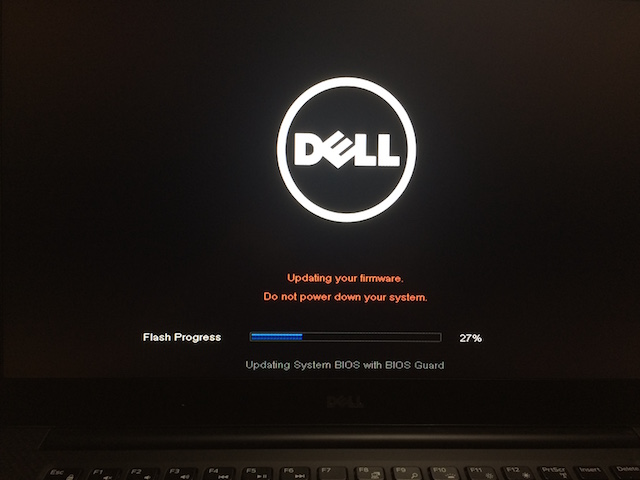
	
	重启完成进入Windows后你再重启一次，重启看见DELL的时候按一下F2，进入BIOS设置画面，在就会显示`General-System Information`里会显示BIOS版本为`01.02.10`，后面我们会再来改变一些设置。

2. 准备一个8G（应该勉强够）或以上的U盘。

## 二、软件准备

1. 下载OSX 10.11.6系统DMG镜像，带Clover引导的那种，省事（只用一个U盘就可以引导+安装） [百度云下载](http://pan.baidu.com/s/1c18RYEG)
2. 下载我提供的软件：[百度云下载](https://pan.baidu.com/s/1i5sJdmH) 密码: `tutp`, 有时可能更新得不及时，最新的直接在本文头顶找吧。

	安装TransMac（在官网或上面的共享下载就行了，试用期15天，还要什么破解版，用那么3、5次就不用了），安装到XPS的出厂自带Windows系统，然后把上面的DMG镜像写入U盘，右击TransMac，以管理员身份运行，然后看图操作，出现Restore Complete即为写入完成。
	
	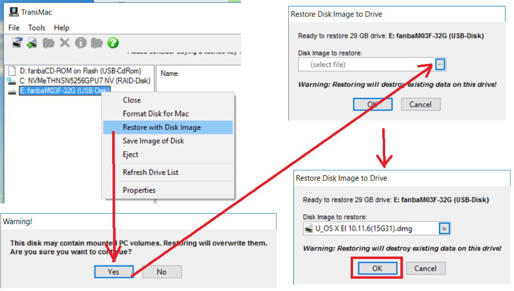
	

3. 打开文件浏览器，发现只有一个名字为EFI的分区（俗称盘），这个分区其实就是TransMac写入你U盘的那个镜像文件创建的，里面有EFI文件夹，有boot文件。

	下载Notepad++，安装到Windows，然后打开U盘的EFI分区，找到`EFI\Clover\config.plist`，用我提供的Clover-Install里面的`config.plist`替换掉它。
	
	然后右击`config.plist`，选用Notepad++打开，按Ctrl+F搜索：`<key>Graphics</key>`，看见`Inject`节点，根据需要修改：
	
	如果你的CPU是i5的话：
	
	```
	<key>ig-platform-id</key>
	<string>0x19160000</string>
	```
	
	如果是i7的话就不用改了（我提供的默认就是i7的，即下面这样）：

	```	
	<key>ig-platform-id</key>
	<string>0x191b0000</string>
	```
	
	**（这下面我已添加了，你知道有这一步就行，后面会用到）**  
	然后我们再搜索`Devices`，看见`Audio`节点，在它往上一行添加下列内容：
	
	```
	<key>FakeID</key>
	<dict>
		<key>IntelGFX</key>
		<string>0x12345678</string>
	</dict>
	```
	
	检查一下没有搞错内容，格式工整，保存config.plist文件，进入下一步。

4. 准备引导系统的必要驱动 

	删除`EFI\CLOVER\drivers64UEFI`文件夹，用我提供的`drivers64UEFI`文件夹放回去。  
	删除`EFI\CLOVER\kexts`目录下所有文件夹，把我提供的`Other`文件夹放这里。

	现在，EFI\Clover\Kexts\Other目录应包含了以下驱动：

	```
	AppleACPIPS2Nub.kext
	ApplePS2Controller.kext
	FakePCIID.kext
	FakePCIID_Intel_HD_Graphics.kext
	FakeSMC.kext
	GenericUSBXHCI.kext
	HackrNVMeFamily-10_11_6.kext  --你想把系统安装在NVME盘的话，要加上这个
	VoodooPS2Controller.kext
	```

	下载我提供的Clover_v2.3k_r3726.zip、CCV.zip等等文件，一起放EFI分区新建一个文件夹放着就可以了，后面用到。

	至此，引导安装U盘就已经做好了，保持插入状态（咦？），进行下一步。

5. 重启XPS15，F2进入BIOS设置：

	- Secure Boot - Secure Boot Enable里改成Disabled
	- General - Advanced Boot Options里，Enable Legacy Option ROMs勾上
	- System Configuration - SATA Operation 改成 AHCI
	- Boot Sequence - Boot List Option确保是UEFI，然后右边点击Add Boot Option.

	出现一个对话框:
	
	
 
	第一个框`Boot Option Name`随便填，这里我写`Clover`，最后一个框`File Name`点击右边的按钮，出现另外一个对话框。	  
	
	选择EFI文件夹
	
	
	
	选择Clover（如果没看见Clover，点击上面的`File System`旁边的下拉列表，换一个FS1或FS2或FS0，总之要找到EFI里有Clover的）

	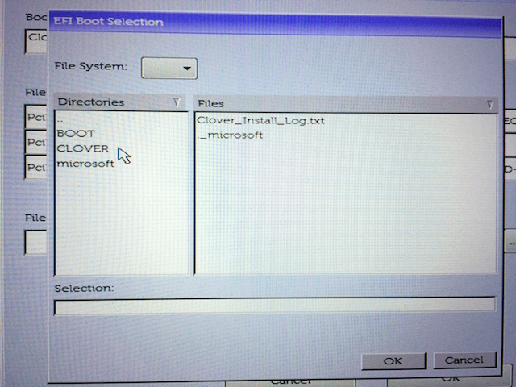

	右边出现`CLOVERX64.EFI`，点击它，点击OK，再点击OK。 
	
	
	 
	现在发现右上角的列表多了一个Clover，把它调到最顶（顺序可以用右边的按钮调节）。  
	
	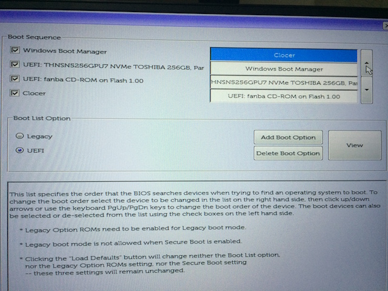
	 
	改完后Apply-Save，OK, Exit，电脑自动重启  

6. 出现横排一行图标的画面，就是Clover引导的画面了
 
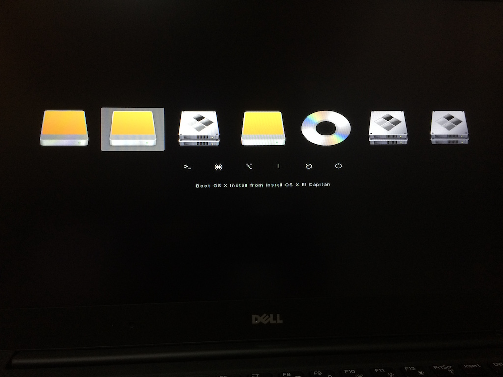
 
按方向键右找找有没有Boot OS X Install from Install OS X EI Caption的（真TM长），对准它按空格键，选择Boot Mac OS X in verbose mode再按空格。

这时候会进入黑底白字很多英文.

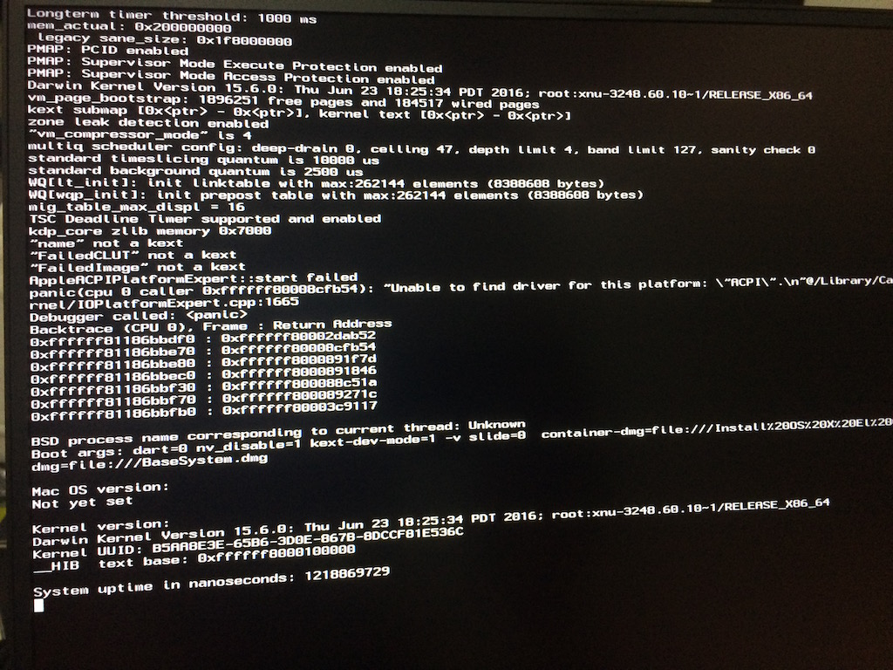

过了2分钟，就进入了白色苹果界面，下面一个进度条。这个白色苹果画面可能进度条不走，别紧张，耐心等2分钟就好了。
 
如果你卡在很多英文的那个界面（俗称V图）5分钟不动，那可能是Clover配置或驱动（Kexts\Other）有问题了，你得仔细检查，检查不出的话，看看V图最后提示什么英文，上论坛搜索一下。


## 三、安装过程

0. 首先提一下，如果你已经能进入安装画面，那接下来的事情其实是根据你自己的需要来调整了，双系统，单硬盘分区一些细节什么的，可以参考：http://bbs.pcbeta.com/viewthread-1649991-1-1.html 非常感谢这系列教程的指导。  
	
	还有就是，接下来会抹掉你原来的Win10系统，你最好还有另外一台可以联网的电脑备用，查找资料什么的。

1. 选择语言为简体中文，然后点击磁盘工具，出现如下图，如果你加载了NVME驱动（上面Other文件夹里的）。
我这里选择TOSHIBA的盘，因为这是我的NVME主硬盘（感谢JS发的官翻XPS不是用PM951），抹掉，名字随便改，抹掉。
	
	
	
	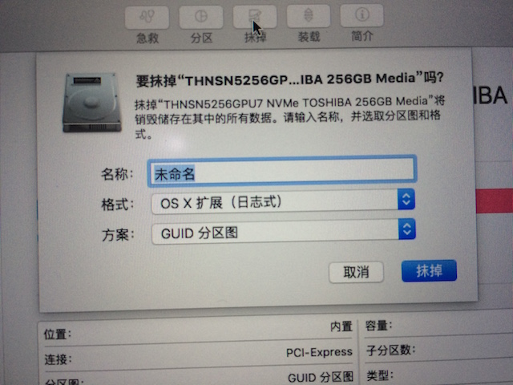

   
	然后点击分区，按你自己的需要，不需要Win系统的话跳过此步。我这里把OSX分区分170G（主力系统，搞开发），剩下的85G留给Win10，点击应用就可以了。
	
	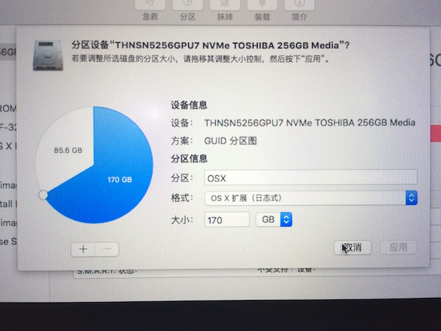
 
	然后关闭磁盘工具，选择安装OS X，点击继续，同意，同意，卖身成功。
	
	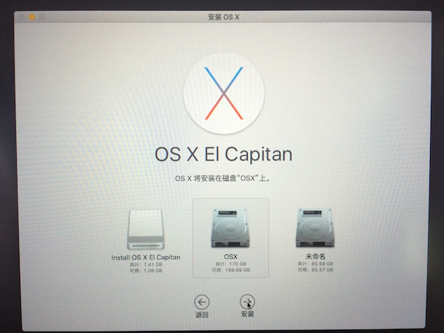

2. 这时候会让你选择安装到哪个分区，选择刚才我们分出来的OSX分区，点击安。

	这时候要界面提示等8分钟，其实“剩余大约1秒钟”这个提示持续了16分钟，要不是看到U盘狂闪，我还真以为它卡死了。
 
3. 等到安装完成，自动重启了，这时候会再次进入到Clover的引导画面，现在有如下两种情况。

	- 如果没有出现`Boot Mac OS X from OSX`图标，就再次选择`Boot OS X Install from Install OS X EI Caption`直接回车，会再进入安装界面，这回是英文界面，自动继续安装，大概也要等20分钟，然后会自动重启。
	
	- 如果出现Boot Mac OS X from OSX图标，直接选择它，回车，跳到下面第5步。

4. 这时候Clover的引导画面已经多了一个选项：`Boot Mac OS X from OSX`，选择这个按空格，再选verbose mode，继续大段英文，就进入OSX系统设置阶段。

	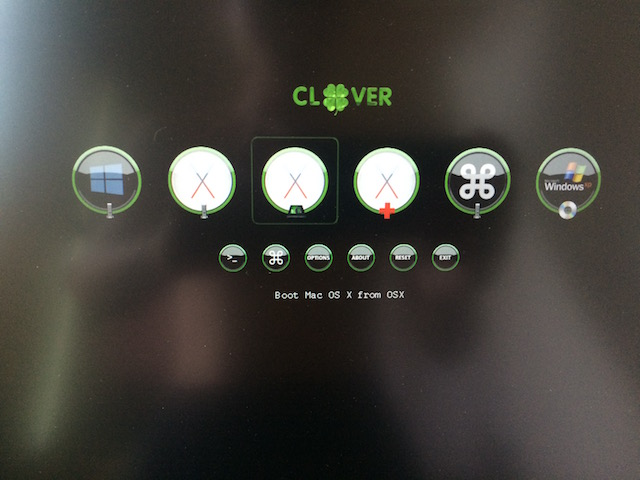

5. 这时候可以按照实际情况设置时区、语言、无线连接、用户登陆什么的，然后就进入系统了。

	我简略提一下这步吧：先是出现选择地区的画面，点击Show All，往下找到China，点击Continue。  
	出现键盘布局选择，直接Continue，出现连接WIFI的画面，选你家的WiFi，输密码，Continue。  
	出现数据迁移画面，直接Continue，出现定位服务画面，随你，我勾了，Continue。  
	出现登陆Apple ID画面，登你手机那个也可以，新注册一个也可以，不登陆就选Don’t sign in，Continue。  
	出现卖身条约，Agree吧，出现系统用户设置画面，起个名字，设个密码，Continue。  
	出现诊断/使用 报告，不勾，Continue，进入桌面。
	
	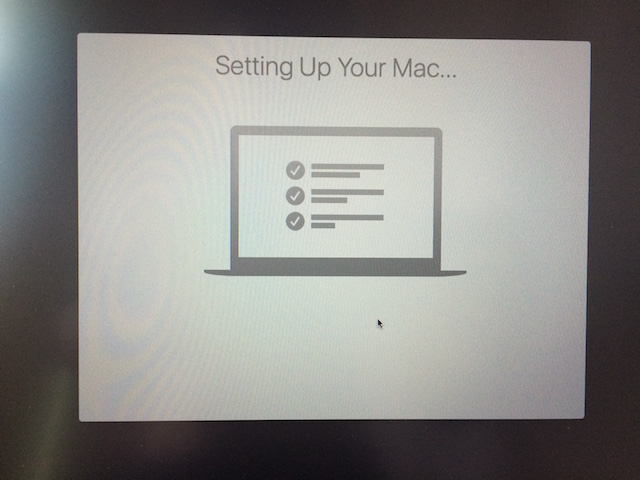


## 四、硬盘引导

目前都是靠U盘引导才能进入系统的，所以我们要把Clover安装到硬盘的EFI分区，让系统脱离U盘引导。

1. 首先挂载EFI分区：
	- 按Alt+空格，出现一个输入框，输入term回车，出现白底黑字的窗口，称为终端，下面我们就这样叫它了。也可以点击屏幕左下角的小火箭，点击Other（其他），点击Terminal（终端）。
	
	- 在终端输入：`mkdir /Volumes/myefi` 回车，注意空格、大小写，回车后什么也不提示表示成功执行。
	
	- 再输入`diskutil list` 回车，出现：
	 
		
	
	- 找到`Install OS X El Caption` 这行对上的那行是EFI，看看这行最左边对应的数字是1，顺着往上看看#号顶上是什么，我这里是`/dev/disk2`，那么接下来的命令就是：
	`sudo mount -t msdos /dev/disk2s1 /Volumes/myefi` 回车，提示输入密码，输入你上面第5小步的时候设置的系统用户密码，什么也不提示表示成功执行。

2. 在屏幕左下方有个蓝白的笑脸图标，叫做Finder，打开它，然后在Finder窗口的左边栏找到EFI，在里面找到前面我叫你下载我提供的所有zip，复制到你桌面待用。

3. 双击Clover_v2.3k_r3726.zip就会自动解压到当前目录，找到文件夹里的Clover_v2.3k_r3726.pkg，双击它出现安装窗口，点击Continue（继续），再Continue，点击Change Install Location...（选择安装位置），选择OSX分区，点击Continue，再点击左边的Customize（自定义），默认已勾选的不用理会。

	勾上`Install for UEFI booting only`（只安装UEFI启动），勾上RC Script，把名字带sleep的那个选项勾上。  
	在Theme（主题）里把`BlackGreen`勾上，Drivers64UEFI里把`OsxAptioFixDrv-64`勾上。  
	然后点击Install（安装），提示输入用户密码，安装完成，点击Close。  

4. 这时候Finder左边有两个EFI分区了，注意区分一下哪个是你U盘的（右边有特殊符号的那个）。
	先把系统的EFI分区里面的Clover\kexts文件夹删除，然后把你U盘的EFI分区Clover\kexts文件夹整个复制到系统的EFI分区那里。  
	然后把你U盘里的`Clover\Drivers64UEFI\HFSPlus.efi`复制到系统的Clover\Drivers64UEFI里。  
	**`感谢ye123963同学的提醒，我漏写了一步，把你U盘里的`Clover\config.plist`复制到系统的Clover，覆盖文件。`**

5. 现在修改一下系统语言，点击屏幕左上角的苹果Logo，第二项，第一行第五个，左下角有个+号，选择简体中文，然后选择PinYin输入法，确定，提示要Restart，点击Restart Now，就重启了，电脑黑屏准备重启的时候把引导U盘拔掉，让系统硬盘的Clover引导。

	耐心等待重启，如果这时候还能出现Clover画面，并且有OSX系统选择，直接回车，能进系统了，要是根本没有进入Clover，那你得检查一下前面的安装Clover步骤有没有搞错了。
	
	至此，你的XPS完全可以脱离U盘引导，没事不用插那个U盘了，可也先别急着清除里面的资料，留着等下你把硬盘的引导搞挂了的时候，再用U盘来救你一命。
	
	现在看看你的OSX系统，应该是半死不活的样子，画面卡得像百叶窗，赶快进入下一阶段吧！

## 五、DSDT

0. 重启电脑，在Clover画面选择系统的时候，按Fn+F4提取DSDT/SSDT，别怀疑，按了之后确实是没有任何反应的，然后进入OSX系统吧。在下一步之前，你可以先粗略看看[这个帖子里面](http://bbs.pcbeta.com/viewthread-1692831-1-1.html)的“关于修改DSDT的一些常识”这小节（不用对着做），然后再回来我这里往下看。

1. 在桌面找到你前面复制出来的东西，其中一个叫CCV.zip，解压。打开Clover Configurator.app，Mount EFI partition，右下角Mount EFI partition（挂载EFI分区），然后Open Partition，弹出了EFI文件夹。

	找到EFI\Clover\ACPI\origin，整个文件夹复制到桌面（记得是桌面，这和后面的命令有关的），目前origin里面的文件是DSDT和SSDT未反编译的文件，从现在开始，我说的origin都是指桌面的那个。

2. 把RehabMan-MaciASL-2016-0423.zip解压，得到MaciASL，双击运行，屏幕左上角`MaciASL - Preferences`，Sources，点击+号，左边随便填，右边URL填：`http://raw.github.com/RehabMan/Laptop-DSDT-Patch/master` 注意大小写，然后关闭，退出MaciASL。

3. 我提供的文件里，含有一个refs.txt，把它放到origin里。  
	还有一个iasl.zip，解压得到iasl，也放到origin里。  
	除了下面列出的文件：其他所有多余的文件都从origin里删除掉。  
	``Iasl、refs.txt、DSDT.aml
	SSDT-0、SSDT-1、SSDT-2、SSDT-4、SSDT-5、SSDT-6、SSDT-7、SSDT-8、SSDT-16、SSDT-17、SSDT-18 ``

4. 打开终端，`cd ~`（波浪号）回车，`cd Desktop/origin` 回车，注意空格和大小写，然后输入下面的命令：
`./iasl -da -dl -fe refs.txt *.aml` 回车，发现origin文件夹多了很多同名的dsl文件，就成功反编译了。  

	在origin里新建一个文件夹Old，把所有aml文件拖进去（按住Alt可以点选多个），这些是原始DSDT/SSDT文件，暂时用不到，  
	我们的目标是dsl文件，把所有dsl文件复制一份，新建一个文件夹叫原版，粘贴。  
	这是个好习惯，每改一个版本我们就复制一份出来，万一改出问题了，我们用前一个版本来覆盖，再改。  

5. 开始修改DSDT/SSDT
	现在origin里所有dsl文件双击都可以自动用MaciASL打开的。  
	
	我们先看DSDT.dsl，下面说的搜索/找到，意思是按Alt+F，MaciASL上面会出现一个搜索条，把想找的内容输入，回车，行为相当于Windows的Ctrl+F，不过OSX这边叫Command+F，XPS的Alt键对应OSX的Command。

	下面说的行数仅供参考，因为BIOS版本不同或硬件不同的话，这些内容的位置也不一定相同的。
	
	别看下面代码好多的样子，其实超简单，就搜索，粘贴或替换，没技术含量的，想起我的Acer 4743G修复电量显示的时候才是痛苦。
	
	每做完一个小步骤，你都应该点击一下MaciASL上面的Compile按钮，确定窗口下方提示是0 Errors，至于warnings就不用管。如果有Error，你应该检查你这一小步是否做错了。
	
	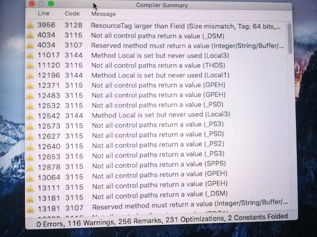
 

### A. 系统模拟
搜索`Name (W98S` ，找到一处，大约在第31325行附近：

    Name (W98S, "Microsoft Windows")
    Name (NT5S, "Microsoft Windows NT")
    Name (WINM, "Microsoft WindowsME: Millennium Edition")
    Name (WXP, "Windows 2001")
    Name (WLG, "Windows 2006")
    Name (WIN7, "Windows 2009")
    Name (WIN8, "Windows 2012")
    Name (WN81, "Windows 2013")
    Name (LINX, "Linux")

在`Name (LINX, "Linux")`后面加一行：
``Name (OSX, "Darwin")``

往下找一下，大约在31368行有这么一句：
`If (_OSI (WN81))`

把它改成：（注意括号不要多也不要少了）
`If (LOr (_OSI (OSX), _OSI (WN81)))`


### B. 亮度调节按键
搜索`Method (BRT6` ，只有一处，大约在31867行，是这样的：

	Method (BRT6, 2, NotSerialized)
	{
		If (LEqual (Arg0, One))
		{
			Notify (LCD,  0x86) 
		}
	
		If (And (Arg0, 0x02))
		{
			Notify (LCD,  0x87) 
		}
	}

如果你要用ApplePS2SmartTouchPad触摸板驱动代替VoodooPS2Controller的话，这样改，否则跳过：

	Notify (LCD,  0x86)  改成  Notify (^^LPCB.PS2K, 0x10)
	Notify (LCD,  0x87)  改成  Notify (^^LPCB.PS2K, 0x20)


然后在第一个Notify下面增加两行：

	Notify (^^LPCB.PS2K, 0x0206)
	Notify (^^LPCB.PS2K, 0x0286)

在第二个Notify下面也增加：

	Notify (^^LPCB.PS2K, 0x0205)
	Notify (^^LPCB.PS2K, 0x0285)

改完就变成这样啦：

	Method (BRT6, 2, NotSerialized)
	{
		If (LEqual (Arg0, One))
		{
			Notify (^^LPCB.PS2K, 0x10)
			Notify (^^LPCB.PS2K, 0x0206)
			Notify (^^LPCB.PS2K, 0x0286)
		}
	
		If (And (Arg0, 0x02))
		{
			Notify (^^LPCB.PS2K, 0x20)
			Notify (^^LPCB.PS2K, 0x0205)
			Notify (^^LPCB.PS2K, 0x0285)
		}
	}


### C. 屏蔽Nvidia独显（在采用Optimus技术的笔记本上安装苹果系统，是用不了独显的，不屏蔽反而白费电）
搜索`PEGP.SGPO`（字母O），只有一处，约在93行附近，在它后面添加这4行：

	External (_SB_.PCI0.PEG0.PEGP._PS3, MethodObj)
	External (_SB_.PCI0.PEG0.PEGP._PS0, MethodObj)
	External (_SB_.PCI0.PEG0.PEGP._OFF, MethodObj)
	External (_SB_.PCI0.PEG0.PEGP._ON, MethodObj)

搜索`Method (_PTS`，只有一处，约在9641行附近，在它上一行插入这两个函数：

	Method (M_OF, 0, NotSerialized) 
	{
	  If (CondRefOf(\_SB_.PCI0.PEG0.PEGP._OFF)) 
	  {
		  \_SB_.PCI0.PEG0.PEGP._OFF() 
	  }
	  If (CondRefOf(\_SB_.PCI0.PEG0.PEGP._PS3)) 
	  {
		  \_SB_.PCI0.PEG0.PEGP._PS3() 
	  }
	}
	
	Method (M_ON, 0, NotSerialized) 
	{
	  If (CondRefOf(\_SB_.PCI0.PEG0.PEGP._ON)) 
	  {
		  \_SB_.PCI0.PEG0.PEGP._ON() 
	  }
	  If (CondRefOf(\_SB_.PCI0.PEG0.PEGP._PS0)) 
	  {
		  \_SB_.PCI0.PEG0.PEGP._PS0() 
	  }
	}
	
好了，现在再看回`Method (_PTS, 1, NotSerialized)`这行，它现在应该在9664附近，我们在它的
花括号{后面加一句`M_ON ()，变成这样：

	Method (_PTS, 1, NotSerialized)  // _PTS: Prepare To Sleep
	{
		M_ON ()
		If (Arg0)
		{
			PTS (Arg0)
			\_SB.PCI0.LPCB.SPTS (Arg0)
			\_SB.PCI0.NPTS (Arg0)
			RPTS (Arg0)
		}
	}


再往下看几行，找到 `Method (_WAK, 1, NotSerialized)`，如法炮制，在它的花括号后面加一句`M_OF ()`，变成这样：

	Method (_WAK, 1, NotSerialized)  // _WAK: Wake
	{
		M_OF ()
		RWAK (Arg0)
		\_SB.PCI0.NWAK (Arg0)
		\_SB.PCI0.LPCB.SWAK (Arg0)
		WAK (Arg0)
		Return (WAKP)
	}

还没完呢，接着搜索`Method (_INI, 0, Serialized)`，在17659附近，如法炮制，加一句`M_OF ()，变成这样：

	Method (_INI, 0, Serialized)  // _INI: Initialize
	{
		M_OF ()
		Store (0x07D0, OSYS)
		If (CondRefOf (\_OSI, Local0))
		……后面代码我不列出了……


好了，Compile一下看看有没有Errors，没有就OK了，保存一下。

### D. 现在我们来用RehabMan（搞黑苹果很厉害的一个外国大神）的脚本来自动修改一部分内容。

首先你当然要联网（WIFI），然后点击Compile旁边的那个Patch按钮，在左边栏应该会出现好多条目的，如果没有出现，右击屏幕底部的MaciASL图标，Quit（退出），再重新打开DSDT.dsl，继续。

在左边栏找到*`[syn] Rename _DSM methods to XDSM`*，点击一下，稍等，右边上方就出现了脚本的内容，下方就是修改前和修改后的内容对比，可以修改的话，Apply按钮就会可点击。
点击Apply，然后右边就没内容了，表示已修改完毕，点击Close，点击Compile，保持0 Errors就没问题。

同样的步骤，找到 *`[igpu] Rename GFX0 to IGPU*`，也Apply一下，然后Close，Compile。

按Alt+S保存文件，关闭MaciASL，继续下面的步骤。


### E. 接下来就厉害了，我们要对所有SSDT开头的文件打两个补丁（按顺序），操作方法相信你已学会，分别是：

	[syn] Rename _DSM methods to XDSM
	[igpu] Rename GFX0 to IGPU

有些SSDT文件可能没有需要修改的地方，补丁的Apply按钮就按不了，正常的，略过即可。

每个SSDT打完这两个补丁之后，Compile，如果是0 Errors就保存，下面我不再提这个Compile步骤了，冗余。

到`SSDT-1`打完补丁Compile的时候我发现有Errors，看了一下，是一些参数悬着，我的修正方案是直接注释掉：
第100行附近：

	Sleep (PGCD)
	\_SB.GGOV (0x02010016)
	OLDV

改成：

	Sleep (PGCD)
	\_SB.GGOV (0x02010016)
	//OLDV


第121行附近：

	Store (\_SB.GGOV (0x02010014), OLDV)
	\_SB.GGOV (0x02010014)
	DFUE

改成

	Store (\_SB.GGOV (0x02010014), OLDV)
	\_SB.GGOV (0x02010014)
	//DFUE


第126行附近：

	Sleep (DFUD)
	\_SB.GGOV (0x02010014)
	OLDV

改成

	Sleep (DFUD)
	\_SB.GGOV (0x02010014)
	//OLDV


`SSDT-18`打完两个补丁后Compile也有Errors，出现在1265行附近，提示*Object does not exist(\_SB.PCI0.iGPU.XDSM)*，在文件38行附近，有一行`External (_SB_.PCI0.IGPU._DSM, MethodObj)`，直接整行复制粘贴到下一行，把`_DSM改成XDSM`，再Compile就没有错误了。


### F. USB3电源补丁
搜索DSDT里的`Scope (_SB.PCI0.XHC)`，有两个结果，我们找下面`有_PRW的那个`，看看下面几个Return里面是什么，我这里Return的是`0x6D,0x03；0x6D,Zero；0x6D,one；`都是`0x6D`开头的，那就打*`[usb] USB3 _PRW 0x6D Skylake(instant wake)`* 这个补丁，这就把睡眠秒唤醒的问题解决了.

也可参考：`http://bbs.pcbeta.com/viewthread-1684255-1-1.html 和 http://bbs.pcbeta.com/viewthread-1626740-1-1.html `

### G. AppleLPC
Skylake的CPU默认不会加载AppleLPC.kext，需要打补丁。给DSDT打补丁*`[sys] Skylake LPC`*,再Compile。

### H. 背光控制补丁
给DSDT打上 *`[igpu] Brightness fix`* 补丁，用来配合后面提到的SLE里面的`IntelBacklight.kext`使用。

### I. 系统补丁
给DSDT打上 `[sys] OS Check Fix (Windows 8)` 补丁。

### J. 假以太网卡内建
这一步的目的是构建一个假的内建网卡, 让你可以在AppStore下载应用. 

为了配合后面安装的NullEthernet.kext(在SLE里), 还需要打个补丁, 把下面的内容粘贴到Patch窗口的右上方, 按Apply, Close, Compile没有Errors，保存，关闭MaciASL.(感谢坛友龙猫喵的提醒，下面修正了代码)
想研究的同学去[Rehabman大神的github](https://github.com/RehabMan/OS-X-Null-Ethernet)看看。

```
# DSDT patch to enable NullEthernet.kext

into device label RMNE remove_entry;
into definitionblock code_regex . insert
begin
Device (RMNE)\n
{\n
    Name (_ADR, Zero)\n
    // The NullEthernet kext matches on this HID\n
    Name (_HID, "NULE0000")\n
    // This is the MAC address returned by the kext. Modify if necessary.\n
    Name (MAC, Buffer() { 0x11, 0x22, 0x33, 0x44, 0x55, 0x66 })\n
    Method (_DSM, 4, NotSerialized)\n
    {\n
        If (LEqual (Arg2, Zero)) { Return (Buffer() { 0x03 } ) }\n
        Return (Package()\n
        {\n
            "built-in", Buffer() { 0x00 },\n
            "IOName", "ethernet",\n
            "name", Buffer() { "ethernet" },\n
            "model", Buffer() { "RM-NullEthernet-1001" },\n
            "device_type", Buffer() { "ethernet" },\n
        })\n
    }\n
}\n
end;
```

### K. 声卡Layout-id
这步可选，如果你的config.plist配置的ACPI - Fixes里勾选了FixHDA，并且Devices - Audio - Inject 框内填了13，就跳过本步骤。  
如果没有上述操作，在DSDT里搜索HDAS，全部替换为HDEF。  
然后打补丁*`[audio] Audio Layout 12`*，注意这里在Apply之前，把右上方补丁内容框里`"layout-id", Buffer() { 12,`这行的12改成13，然后再Apply。


**7.编译DSDT/SSDT**  
现在origin里新建一个文件夹叫Ver1，把所有dsl文件复制一份进去留作备份。  

然后我们打开DSDT.dsl，点击屏幕左上角的File - Save as...，在弹出的对话框中，File Format选择`ACPI Machine Language Binary`，在文件名后面加上.aml，点击Save保存。  

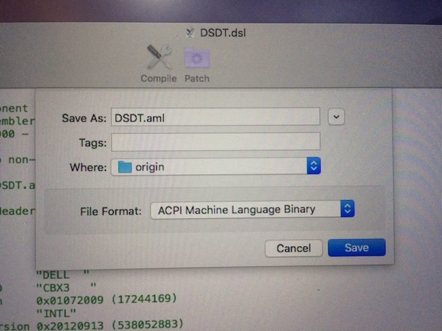

对origin里其他.dsl文件进行上述的保存操作，生成所有.aml文件。  

然后把这些aml文件全部复制到系统EFI分区的`Clover\ACPI\patched`里面（还记得怎样挂载EFI分区吗？用Clover Configurator.app，看看本节的第1小点）

>然后，这些aml文件都是你的宝贝，要好好保存起来，以后有什么问题需要重新安装系统，这些aml不用重新制作了，只要覆盖到系统EFI分区的`Clover\ACPI\patched`里面就可以了，因为你的BIOS没有升级，你的硬件没有变化的情况下，DSDT/SSDT都是一样的。

**8.让DSDT/SSDT生效**

打开`Clover\config.plist`，现在系统应该默认是用Clover Configurator.app打开它的。  
点击左边Acpi项，右下边找到SSDT的框里面的Drop OEM勾上。  
点击左边Devices项，把IntelGFX框的内容0x12345678清空。 
然后点击屏幕左上角的File，Save，关闭Clover Configurator.app，如果还有提示框出现，点击OK。


## 六、更多Kext驱动
1. 现在把EFI\Clover\kexts\Other里面的GenericUSBXHCI.kext删除。  
	如果你前面做了*五.5.B*步骤的话，把VoodooPS2Controller.kext，ApplePS2Controller.kext，AppleACPIPS2Nub.kext也删除。

2. 把我提供的MoreKexts.zip解压，里面的所有kext驱动放进去EFI\Clover\kexts\Other里。

3. 把我提供的Kext_Utility.app.v2.6.6.zip解压，得到Kext Utility.app，双击运行输入密码，出现一个白窗口，等待窗口下面的小菊花转到消失。

	把我提供的SLE.zip解压得到SLE文件夹，选中里面所有文件，（如果你不需要ApplePS2SmartTouchPad，就不要选它，CodecCommander也可以不选，等发现睡眠唤醒没声音才安装），拖进`Kext Utility`的白窗口，等待小菊花消失。

4. 删除网络配置(为了配合NullEthernet.kext)

	打开`系统偏好设置 – 网络`, 把左边所有的有线无线网络接口都删除(点下面的减号), 然后去删除/Library/Preferences/SystemConfiguration/NetworkInterfaces.plist, 如何打开呢? 在终端输入`open /Library/Preferences/SystemConfiguration`, 就出现了, 然后找到`NetworkInterfaces.plist` 删除掉.

	重启后发现声音有了，电量显示了，显卡驱动起来了，如果触摸板不正常，再重启多两次就正常了。

5. 现在把网络设置里面的网卡添加回来, 要先添加以太网卡, 再添加无线网卡, 然后应用. 

6. 小问题
	
	如果你用的是VoodooPS2Controller的话，按FN+S或FN+B是亮度调节；如果用的是ApplePS2SmartTouchPad，亮度和音量调节的按键都是原按键（F11、F12），但格数都不准，很苦恼，后来用了syscl的那个4.5版本就好了。

	还有就是ApplePS2SmartTouchPad的双指滚动有点问题，需要在系统设置-触摸板里面随便调整一下滚动速度才可以生效。

## 七. 附加补丁

- Corenel的github上提供了他自己的配置，其中有个`ssdt-uiac.aml`，这个和`USBInjectAll.kext` （在我的MoreKexts里）配合使用的，用来启用所有USB端口，修复一些问题(比如用不了内置摄像头，内置蓝牙)，你放ACPI\patched里面好了。  
	- 想研究的也可以看看：[驱动地址](https://github.com/RehabMan/OS-X-USB-Inject-All)

- 还有个`SSDT-ALC298.aml`，配合`CodecCommander.kext`使用的，修复睡眠/唤醒后，声音的状态，也是放patched里面，但**在我这里两者都不用也可以唤醒有声，所以推荐你真正发现唤醒无声才用**。  
	- 想研究的也可以看看：[驱动地址](https://github.com/RehabMan/EAPD-Codec-Commander) 这里的是dsl，自己编译成aml使用。

- 通用补丁，在Rehabman大神的教程[Patching LAPTOP DSDT/SSDTs](https://www.tonymacx86.com/threads/guide-patching-laptop-dsdt-ssdts.152573/)里，提到有些通用补丁可以打（我试了好像打不打无关痛痒，随你喜欢）
	- "Fix _WAK Arg0 v2"
	- "HPET Fix"
	- "SMBUS Fix"
	- "IRQ Fix"
	- "RTC Fix"
	- "Fix Mutex with non-zero SyncLevel"

## 八. CPU变频

终端执行：`curl -o ~/ssdtPRGen.sh https://raw.githubusercontent.com/Piker-Alpha/ssdtPRGen.sh/Beta/ssdtPRGen.sh`

然后：`chmod +x ~/ssdtPRGen.sh`  
最后：`./ssdtPRGen.sh`  
如果提示：`Compilation complete. 0 Errors, 0 Warnings, 0 Remarks, 0 Optimizations`  
就是生成变频SSDT成功。

接下来还有提示：  
`Do you want to copy /Users/XXX/Library/ssdtPRGen/ssdt.aml to /Extra/ssdt.aml? (y/n)?  输入n回车`    
`Do you want to open ssdt.dsl (y/n)?  输入n回车`

然后输入：`open ~/Library/ssdtPRGen/` ，弹出窗口，找到ssdt.aml 和 ssdt.dsl，复制到origin，把ssdt.aml复制到EFI分区的patched里面，重启。

再次强调，因为**我上面采用的config.plist已经在SSDT-OEM列表包含了ssdt.aml**，所以这里只需要复制过去patched就好，没有额外工作。

重启发现，系统启动速度更快了！系统设置里的节能器出现了`Power Nap`的勾选项.

## 九、HDMI输出

根据Corenel的github上面说的，你用了`iMac7,1`这个SMBIOS的话（上面我的config.plist就是），你要这样操作：

1. 打开你的config.plist找到SMBIOS里面的`Board-ID`,我这里是`Mac-B809C3757DA9BB8D`.

2. 用文本编辑打开/System/Library/Extensions/AppleGraphicsControl.kext/Contents/PlugIns/AppleGraphicsDevicePolicy.kext/Contents/Info.plist

	搜索Mac-B809C3757DA9BB8D, 它下面一行有Config2, 改成none, 保存.

3. 重建缓存：`sudo touch /System/Library/Extensions && sudo kextcache -u /` ,然后重启.

> 上面的方法在遇到重装系统或者升级的时候需要再次修改,下面介绍另外一种, 原理参考syscl的: [一劳永逸！更新不再替换Kext(Kexts to patch)教程](http://bbs.pcbeta.com/viewthread-1580832-1-1.html)

Clover Configurator打开config.plist左侧选择`Kernel and Kexts patch`,在右边的`KextsToPatch`里点击加号,新添加了一行.

- Name填`AppleGraphicsDevicePolicy`

下面的数值只适用于`Mac-B809C3757DA9BB8D`这个ID。

- Find填
`3e4d61632d423830394333373537444139424238443c2f6b65793e0a090909093c737472696e673e436f6e666967323c2f737472696e673e0a09`

- Replace填
`3e4d61632d423830394333373537444139424238443c2f6b65793e0a090909093c737472696e673e6e6f6e653c2f737472696e673e0a09090909`

- Comment随便填个`Fix HDMI output`, 勾上`InfoPlistPatch`, 保存, 重启.


## 一些小问题修复

1. 磁盘没有正确推出

	我留意到，在OSX连接着USB移动磁盘的时候进入睡眠或者关机，系统会在瞬间使磁盘断电，导致“咔”的一声响（硬盘的磁头没有正确归位，容易产生坏道），于是搜索了一下，看见了syscl大神的帖子[解决唤醒后磁盘没有正确推出问题](http://bbs.pcbeta.com/viewthread-1680369-1-1.html)，方法如下：

	终端执行：`git clone https://github.com/syscl/Fix-usb-sleep`，提示需要安装软件，点击安装，等5分钟左右安装完，然后再执行一次本命令。  
	上面的提示完成之后输入：`chmod +x ~/Fix-usb-sleep/fixUSB.sh`  
	然后：`cd ~/Fix-usb-sleep`  
	最后：`./fixusb.sh`，提示输入你的密码，提示`DONE! Sleep to see change.`表示成功了, 你可以自己测试一下效果.  
	我测试的效果是，再也没有异常的响声了，也不会提示未正确推出了。

2. 休眠醒来变重启  
这个我是通过设置成0模式休眠来解决的：`sudo pmset -a hibernatemode 0`

## 未解决的问题

1. 亮度调节不正常，只有10档，用了ApplePS2SmartTouchPad驱动后，级别也不正常，一气之下打了个**Haswell/Broadwell的Brightness fix**补丁，似乎稍好，变成17档了（最低那3档不正常，轻微闪屏）。

2. 进入睡眠的时间稍长（有时可能20-30秒），当然，睡得挺好，我睡前让它睡了，起床后再开盖，也能醒过来。

3. 似乎亮度不能保存，重启后是BIOS里设置的默认亮度。


## 顺便学习到一些命令：

- 解除驱动器的只读模式：`mount -uw /` ，这个在安装盘的终端下有时会用到，比如装错驱动进不了系统，想删掉。
- 手动安装驱动：`sudo cp -R xxx.kext /Library/Extensions`，然后重建缓存
- 重建缓存：`sudo touch /Library/Extensions && sudo kextcache -u /`

## 引用
 准备加SATA硬盘，问了Dell销售电话: 4008816875，结果中秋后第一个工作日和第三个工作日（上班时间内）各打一次都提示非工作时间，其实我就是想问问贵销售部还招不招人，没想买东西来着……

> 安装过程参考了老外教程：[tonymacx86](http://www.tonymacx86.com/threads/guide-dell-xps-15-9550-skylake-gtx960m-ssd-via-clover-uefi.192598/)

> 我上面的驱动多数是抄自corenel大神的github，驱动什么的我从他这里找的：[corenel-xps9550-osx](https://github.com/corenel/XPS9550-OSX)

> 也特别佩服syscl大神不断地完善他的机子，可惜我买的不是M3800（9530）：[syscl-M3800](https://github.com/syscl/M3800)   
（我用了他的ApplePS2SmartTouchPad 4.5，解决了亮度和音量的格数问题）


